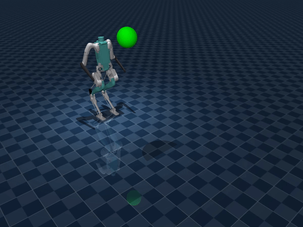
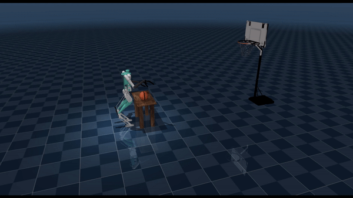

# KinodynamicFabrics.jl
Julia implementation of the Kinodynamic Fabrics Whole-Body Control framework.

Project webpage: [adubredu.github.io/kinofabs](http://adubredu.github.io/kinofabs)

## Installation
1. Clone this repository using the command `git clone -b sim https://github.com/adubredu/KinodynamcFabrics.jl`
2. Navigate to the parent directory of this repo and type  `julia` in your terminal to launch the Julia REPL.
3. Press `]` on your keyboard to enter the package manager 
4. Enter command `activate .` then enter command `instantiate` to download all package dependencies
5. Once installation is complete, press the `Backspace` key on your keyboard to return to the REPL

## Usage
Checkout the [examples](examples) folder for usage examples.

To run the dodge ball example, run the following command
```
include("examples/dodge_ball.jl")
```

You should see the visualization below:





To run the dodge ball with end-effector goal example, run the following command
```
include("examples/dodge_ball_maintain_ee.jl")
```

You should see the visualization below:


To run the cornhole example, run the following command
```
include("examples/cornhole.jl")
```

You should see the visualization below:


To run the basketball example, run the following command
```
include("examples/basketball.jl")
```

You should see the visualization below:





To run the package delivery example, run the following command
```
include("examples/package_delivery.jl")
```

You should see the visualization below:


**Note:** The initial run of the example may have a delayed startup of the *mujoco-python-viewer* and other intermittent delays in-between simulation. If the interface asks, click `Wait`, and it may take up to 30 seconds to run. After the first run you should no longer have any delays. 

## Citing
```
@article{adubredugibson2023,
    title={Exploring Kinodynamic Fabrics for Reactive Whole-Body Control of Underactuated Humanoid robots},
    author={Adu-Bredu, Alphonsus and Gibson, Grant and Grizzle, Jessy},
    journal={},
    url={},
    year={2023}
}
```
